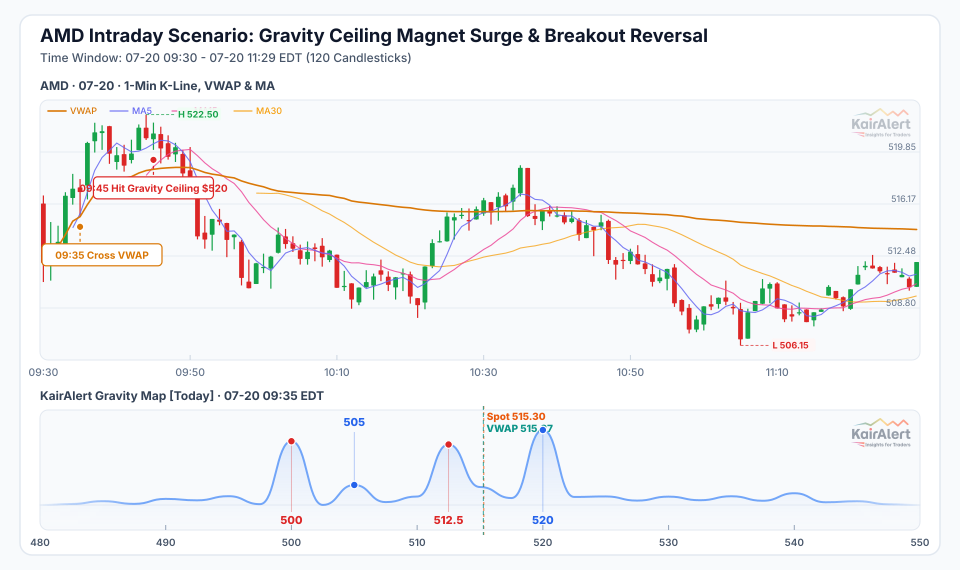
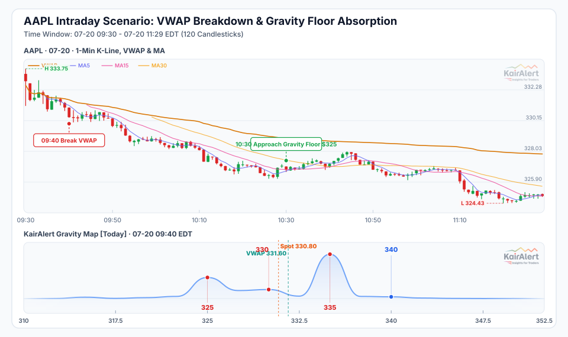
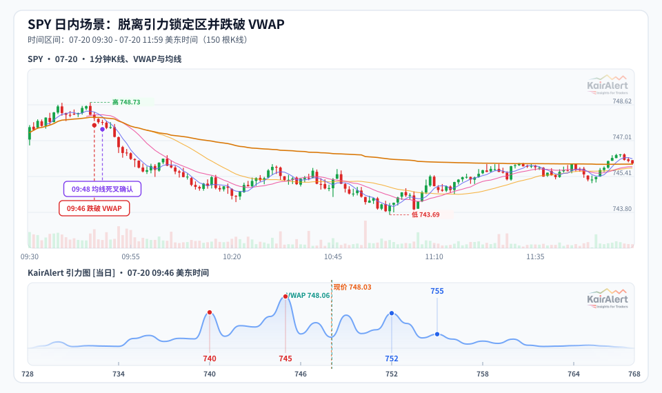
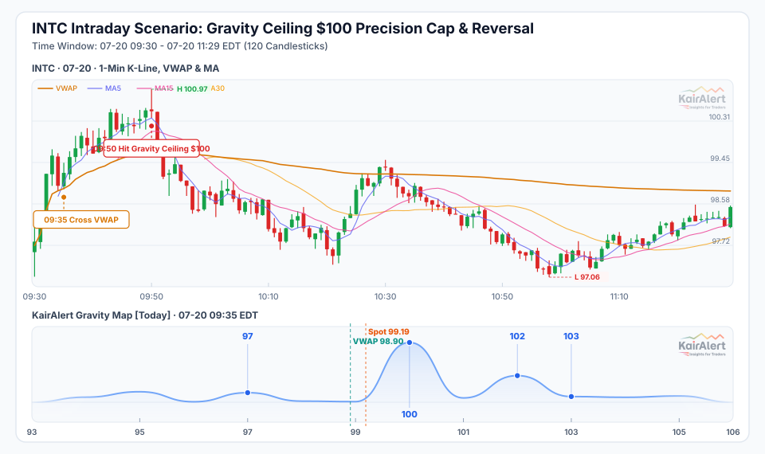

# KairAlert Gravity Map 日内实战指南

> 这份文档解释如何用 KairAlert Gravity Map 结合 VWAP 和均线，在日内交易中做出更精准的决策。

---

## 一、引力图能告诉你什么

引力图描述的是当前期权市场对各个价格区间的"注意力分布"。

简单说：

- 哪些价格附近**引力更强**，价格更容易在这里停留、验证，或者被吸引过来。
- 哪些价格区间是**上方压力**，价格到了容易被压回来。
- 哪些价格区间是**下方支撑**，价格跌到了容易被托住。

它不是预测价格会涨还是跌，而是告诉你**当前结构里哪些位置更重要**。

### 图上关键元素

| 元素                 | 含义                                                                   |
| :------------------- | :--------------------------------------------------------------------- |
| **引力曲线峰值**     | 该价格区间的引力最强，是最重要的"验证位"，价格容易在此停留、反弹或受阻 |
| **上方关键引力区**   | 现价上方引力最集中的位置，价格到达后易受阻或回落，是重要的止盈参考     |
| **下方支撑引力区**   | 现价下方引力最集中的位置，价格下跌到此易获支撑，是低吸的参考区域       |
| **橙色虚线（Spot）** | 快照时刻的现货价格，用于判断当前价格相对引力结构的位置                 |
| **青色虚线（VWAP）** | 同一时刻的成交量加权均价，是日内多空的分水岭                           |

---

## 二、和 VWAP、均线怎么配合

引力图告诉你"哪里有结构"，但不告诉你"现在是涨还是跌"。这个判断要靠 VWAP 和均线等其他技术指标来补充。

**VWAP（成交量加权均价）**

VWAP 是当天最重要的参考线。简单理解：

- 价格在 VWAP 上方：今天的买盘整体占优，做多方向更顺。
- 价格在 VWAP 下方：今天的卖盘整体占优，做空方向或观望更稳。

**MA5 / MA15（5 分钟均线 / 15 分钟均线）**

- MA5 反映短线动能，MA15 反映盘中趋势。
- MA5 在 MA15 上方（金叉）：短线偏多，适合持有多头或寻找做多机会。
- MA5 在 MA15 下方（死叉）：短线偏空，做多要谨慎。

**三个结合起来用：**

| 当前状态                                  | 操作思路                                 |
| ----------------------------------------- | ---------------------------------------- |
| 价格 > VWAP，MA5 > MA15，上方有关键引力区 | 顺势做多，目标看上方引力区               |
| 价格 < VWAP，MA5 < MA15，下方有关键引力区 | 避免做多，等待下方引力区支撑后确认再入场 |
| 价格在强引力区附近震荡，上下都有压力      | 不做方向，等突破确认后再跟               |

---

## 三、0720 四个真实案例

以下是 2026-07-20 美股当日的四个案例，每张图展示的是事件发生前后约两小时的 1 分钟 K 线，配合引力图快照。

---

### 案例一：AMD — 快速拉升到上方关键引力区后回落



**开盘结构：**

开盘时现价 $512.67，引力图显示上方 $520 是最强的关键引力区（也是上方最大压力位），下方 $500 是最强的支撑吸附区。现价夹在两者之间，距上方约 1.4%。

**09:35 — 价格站上 VWAP**

开盘后几分钟，K 线收在 VWAP 上方，多头动能启动，引力图中 $520 对价格的吸引作用开始显现。

**09:45 — 触及上方关键引力区**

价格被 $520 引力区吸引，最高冲到 $521.93，触及该引力区。但触及后并没有放量突破，很快开始往回走。

**09:50 — 跌破 VWAP，方向反转**

价格跌破 VWAP，MA5 跌到 MA15 下方，多头结构被打破。此后价格从 $520 区域持续回落到 $510 附近，贴近下方 $500 支撑区。

**10:30 — 重新站上 VWAP**

价格在 $510 区域整理后重新站上 VWAP，MA5 重新上穿 MA15，多头动能再次启动。

**这个案例说明什么：**

> 现价位于上方关键引力区下方 1%~2% 时，一旦站上 VWAP，价格往往会被引力区"吸过去"。
> 但到了之后要看 K 线是否有效站稳，跌回 VWAP 以下就是止盈信号，不是继续持仓的理由。

---

### 案例二：AAPL — 跌破 VWAP 后持续被下方引力区吸引



**开盘结构：**

开盘现价 $333.12，引力图显示下方 $325 是当日最强的吸附区，负向引力极大，上方 $340 是压力区。

**09:40 — 跌破 VWAP**

开盘不久价格就跌破了 VWAP，同时下方 $325 的引力在快速增强（从 -43 升到 -53）。跌破 VWAP 后 MA5 持续在 MA15 下方，空头结构成立。

**此后持续下行**

价格没有回踩复盘，持续向下方 $325 引力区方向移动。到 10:00 时（现价 $328.84），下方引力增大到 -92.8；到 10:15 时（现价 $327.00）达到 -152.3；到 10:30 时（现价 $326.75）达到 -176.9。现货价格与下方 $325 强引力吸附区的距离逐步缩小，到 10:30 仅剩 0.54%。

**10:45 — 贴近 $325 附近短暂企稳**

价格贴近 $325 引力区后，K 线出现小幅反弹，MA5 短暂上穿 MA15，这是下方引力支撑显现的信号。

**这个案例说明什么：**

> 跌破 VWAP 之后，如果下方有强引力区，价格会被持续往那个方向拉。
> 此时不要逆势抄底，等价格真正贴近引力区、K 线出现止跌信号（下影线、缩量）再考虑。
> 下方引力值越大，说明吸附越强，但也意味着跌势越快。

---

### 案例三：SPY — 开盘锁定在强引力区附近，跌破 VWAP 后才有方向



**开盘结构：**

开盘现价 $747.53，引力图显示 $747 附近有极强的引力能量（超过 1000），上方 $755 是压力区，下方 $740 是支撑区。现价和最强引力区几乎重合。

**09:30 开盘起 — 价格在 $747~$749 窄幅震荡**

由于当前价格就在最强引力区内，做市商的仓位在这里形成明显的"锁定"效应。开盘后 20 分钟价格几乎没有方向，在 VWAP 附近小幅上下。

**10:00 — 跌破 VWAP，震荡结束**

价格跌破 VWAP，同时下方负向引力快速集中（到 11:00 时已达 -644）。此后价格持续在 VWAP 下方，未能回升。

**这个案例说明什么：**

> 当价格与引力图中最强的集中区高度重合时，不会有明显方向，就是震荡。
> 这时候不适合做方向性仓位，要等价格脱离这个区间、并配合 VWAP 突破，才有方向性机会。
> 对于大盘指数（如 SPY），这种锁定现象更常见，因为引力能量更集中。

---

### 案例四：INTC — 快速拉升触及上方关键引力区后精准回落



**开盘结构：**

开盘现价 $97.75，引力图显示上方 $100 是最强的压力区（引力能量 1.9），下方 $90 是支撑区。现价距上方约 2.3%。

**09:35 — 站上 VWAP，快速向上方引力区移动**

开盘后 K 线迅速站上 VWAP，价格以很快的速度向 $100 区域靠近，引力图中 $100 的能量同步从 1.9 快速增大到 3.5。

**09:45~09:50 — 触及 $100 区域，引力能量达到峰值**

价格突破 $100，最高到 $100.97。此时引力图中 $100 的能量已经达到 6.1，压力极限。

**09:50 之后 — 跌破 VWAP，确认回落**

触及 $100 后价格迅速回落，随后跌破 VWAP，MA5 跌到 MA15 下方，确认顶部成立。此后价格持续在 VWAP 下方运行。

**这个案例说明什么：**

> 价格快速拉升到上方关键引力区时，如果引力能量在"同步快速增大"，说明压力正在实时积累，这是止盈的信号。
> 触及引力区 + 跌破 VWAP + 均线死叉，三个一起出现，就是顶部确认。
> 不要等更多确认信号，回到 VWAP 以下就止盈。

---

## 四、操作上的几个关键原则

根据以上四个案例，可以总结出几个实际操作时用得上的原则：

**1. VWAP 是今天最重要的参考线**

每天开盘的第一件事是观察价格站在 VWAP 哪一侧。站在上方，优先找做多机会；站在下方，不要轻易做多，更多是等待。

**2. 引力图告诉你目标在哪里，不告诉你出发**

上方有引力区，不代表价格一定会去；价格站上 VWAP 才是"出发"的确认信号。两个都满足才入场。

**3. 到了引力区，要看 K 线能不能站稳**

价格到达引力区后，最重要的是看接下来的 K 线。如果触及后立刻开始反向，跌回 VWAP，就是止盈信号，不是继续持仓的理由。

**4. 引力区附近的"锁定"不要硬做方向**

价格和最强引力区高度重合时，往往是震荡，上下都难有突破。这时候不是好的入场时机，等脱离这个区间再说。

**5. 下方引力值在快速增大，不要逆势抄底**

如果引力图中下方的能量在一直增大，说明市场的引力还在往下拉，不要轻易抄底，等能量不再扩大、K 线有止跌信号才考虑。

---

## 五、开盘前该看什么

```
□ 开盘前：
    - 上方关键引力区在哪里？距离现价多少？
    - 下方支撑区在哪里？
    - 整体引力偏向上方还是下方？

□ 开盘后：
    - 价格在 VWAP 上方还是下方？
    - MA5 和 MA15 的关系是金叉还是死叉？
    - 价格距离引力区还有多少距离？

□ 入场前需要同时满足：
    - 价格在 VWAP 上方（做多）或下方（做空/观望）
    - 方向和均线一致
    - 引力区在合理距离内（1%~3%）
```
